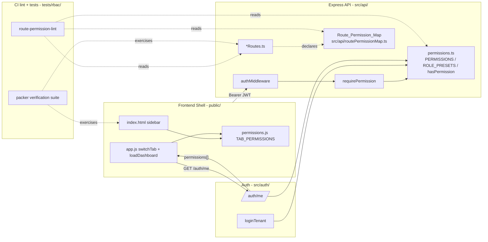

# Design Document: RBAC Enforcement Audit

## Overview

This design hardens RelayOS's RBAC enforcement end-to-end by closing four defects identified in
investigation: the legacy-token bypass in `requirePermission`, missing per-endpoint permissions on most
routers, an un-gated frontend sidebar, and the silent `*` backfill for legacy tenants.

The work is intentionally scoped to enforcement and migration. The authoritative permission catalog
(`src/auth/permissions.ts`) and the existing `requirePermission` factory shape are kept; what changes is
that every authenticated route declares a permission, the middleware rejects tokens missing the claim, the
frontend renders only what the user can see, and legacy tenants are migrated through a controlled review
path rather than auto-promoted.

The goal is that after deploy:

- No legacy JWT can call any route except `/auth/login` / `/auth/me` (which both return
  `TOKEN_EXPIRED_REAUTH_REQUIRED`).
- Every router under `src/api/*Routes.ts` (other than `authRoutes.ts`, public webhooks, and onboarding)
  declares `requirePermission(...)` on every endpoint, drawn from `PERMISSIONS`.
- The packer-role user can only see and call packer-allowed tabs and endpoints, and a CI verification
  suite proves it.

## Architecture



The Route_Permission_Map is the single declarative source for which permission protects which endpoint.
Routers continue to call `requirePermission(...)` directly (so enforcement happens in middleware, not via
a registry lookup at runtime), but the map is the single document the audit, the verification suite, and
the CI lint check all read.

## Components and Interfaces

### 1. `src/api/middleware.ts` — `requirePermission` (modified)

Drop the legacy "no permissions = super admin" fallback that exists today. The factory body is already
mostly correct in the current code (it returns 401 `TOKEN_EXPIRED_REAUTH_REQUIRED` when `permissions` is
undefined / null) — the work in this feature is to:

- Verify the current behavior is preserved verbatim against Requirement 1 (no `permissions` -> 401
  `TOKEN_EXPIRED_REAUTH_REQUIRED`; empty `permissions` -> 403 `FORBIDDEN`; insufficient -> 403
  `FORBIDDEN`; sufficient -> `next()`).
- Ensure every 403 response body contains `error.required: string[]` (clause 1.5).
- Add a unit test pinning all four branches so a future regression of the `if (!permissions) return
  next()` shape fails CI.

Signature is unchanged:

```typescript
export function requirePermission(...required: string[]): RequestHandler;
```

### 2. `src/api/routePermissionMap.ts` (new)

A single TypeScript module that re-exports a typed table of every authenticated endpoint mounted by
`createApiServer`. The runtime decision is still `requirePermission(...)` on the router; the map is the
canonical document tested, linted, and walked by the verification suite.

```typescript
import { PERMISSIONS } from '../auth/permissions';

export type RouteSpec = {
  router: string;          // e.g. 'pipelineRoutes'
  method: 'GET' | 'POST' | 'PUT' | 'DELETE' | 'PATCH';
  path: string;            // mounted path, e.g. '/pipeline/jobs/:id'
  permission: string | string[] | 'auth-only';
  justification?: string;  // required when permission === 'auth-only'
};

export const ROUTE_PERMISSION_MAP: RouteSpec[] = [
  // authRoutes.ts — exempt from requirePermission audit
  { router: 'authRoutes', method: 'POST', path: '/auth/register', permission: 'auth-only',
    justification: 'public registration endpoint' },
  { router: 'authRoutes', method: 'POST', path: '/auth/login',    permission: 'auth-only',
    justification: 'public login endpoint' },
  { router: 'authRoutes', method: 'POST', path: '/auth/logout',   permission: 'auth-only',
    justification: 'any authenticated user can log themselves out' },
  { router: 'authRoutes', method: 'GET',  path: '/auth/me',       permission: 'auth-only',
    justification: 'returns the caller their own permissions; gating it would be circular' },

  // pipelineRoutes.ts
  { router: 'pipelineRoutes', method: 'GET',  path: '/pipeline/jobs',
    permission: PERMISSIONS.ORDERS.VIEW },
  { router: 'pipelineRoutes', method: 'GET',  path: '/pipeline/jobs/:id',
    permission: PERMISSIONS.ORDERS.VIEW },
  { router: 'pipelineRoutes', method: 'GET',  path: '/pipeline/stats',
    permission: PERMISSIONS.ORDERS.VIEW },
  { router: 'pipelineRoutes', method: 'POST', path: '/pipeline/trigger/:emailId',
    permission: PERMISSIONS.ORDERS.MANAGE },
  { router: 'pipelineRoutes', method: 'POST', path: '/pipeline/jobs/:id/reprocess',
    permission: PERMISSIONS.ORDERS.MANAGE },

  // ... full table elaborated in §"Route_Permission_Map" below
];
```

`RouteSpec` is the source of truth for the audit table. The CI lint check reads it; the packer
verification test walks it; the design's "Route_Permission_Map" section below shows the full proposed
table.

### 3. `src/auth/index.ts` — `loginTenant` (modified)

The legacy fallback path that today inserts a `tenant_users` row and a `user_permissions` row with `*`
becomes a *bounded* backfill:

- If a `tenants` row authenticates and there are zero `tenant_users` rows for that tenant, **and** the
  `tenants.email` matches what the caller logged in with, mint a single `tenant_users` row whose
  permissions equal `ROLE_PRESETS.super_admin` (`['*']`). This preserves the original tenant owner's
  super-admin access (Requirement 5.2).
- If a `tenants` row authenticates and there is already at least one `tenant_users` row but none match
  `tenants.email`, do not auto-promote. Insert a `tenant_onboarding_events` row of type
  `rbac_review_required` with the conflicting `tenant_users.id` values, and reject the login with
  `AuthError('RBAC_REVIEW_REQUIRED')` so an operator can resolve it. (Requirement 5.4)
- The 1:1 happy path of "tenant_users row matches the login email" is unchanged.

The idempotent backfill insert remains — what changes is the *permission* it grants and the *event* it
emits.

### 4. `src/api/authRoutes.ts` — `/auth/me` (mostly unchanged)

The current handler already (a) re-queries `user_permissions` live and (b) returns 401
`TOKEN_EXPIRED_REAUTH_REQUIRED` when `req.tenant.permissions` is undefined. The design only requires
that `data.user.permissions` is present on the success path (Requirement 3.1) — already true in the
current code. We add a unit test pinning the shape and the legacy-token branch.

### 5. `public/permissions.js` — `TAB_PERMISSIONS` + helpers (kept, slightly expanded)

The current file already exports `TAB_PERMISSIONS`, `hasPermission`, `hasAnyPermission`, `canSeeTab`, and
`applySidebarFilter` on `window.RelayPermissions`. This is the single tab-to-permission mapping
required by Requirement 8.5; both the sidebar render path and the `switchTab` guard already consult it.
What changes:

- The `'overview'` entry today is `null` (any authenticated user). Keep this. Document the contract.
- Add a `'packing'` entry already present (`orders.view`); audit every `data-tab` / `switchTab` id in
  `public/index.html` and ensure it has a corresponding `TAB_PERMISSIONS` entry. The CI lint added in
  Requirement 8.3 validates that every value in `TAB_PERMISSIONS` is a real `PERMISSIONS` value.
- `applySidebarFilter` already hides empty `.nav-section` headers (Requirement 4.3) — keep it.

### 6. `public/app.js` — `switchTab`, `loadDashboard`, `init` (kept)

The current code already:

- Calls `GET /auth/me` on `loadDashboard` and stores `currentUserPermissions` in module scope (not
  `localStorage`) — satisfies Requirements 3.3 and 3.4.
- Redirects to login on `TOKEN_EXPIRED_REAUTH_REQUIRED` — satisfies Requirement 6.2.
- Guards `switchTab` with `RelayPermissions.canSeeTab` — satisfies Requirement 4.4.

What this design adds:

- Replace the `toast('Not authorized for this view', 'error')` with the empty-state UX described in
  Requirement 4.4 / 4.7 (a panel inside the content area instead of a toast that vanishes), so deep
  links to a forbidden tab show a stable explanation rather than a 1.5-second toast.
- Render the "Review super-admin assignments" banner on the Team & Roles tab from
  `loadUsers` when any returned user holds `*` (Requirement 5.5). The banner reads from the existing
  `GET /users` response.

### 7. `tests/rbac/` (new)

Three test artifacts:

- `tests/rbac/middleware.test.ts` — pins the four branches of `requirePermission`.
- `tests/rbac/packerVerification.test.ts` — boots the API with `createApiServer`, seeds a
  `tenant_users` row whose `user_permissions` equal `ROLE_PRESETS.packer` exactly, and walks every entry
  in `ROUTE_PERMISSION_MAP`, asserting 401/403/2xx per the policy.
- `tests/rbac/sidebar.test.ts` — loads `public/index.html` into a JSDOM, evaluates `permissions.js`
  + `applySidebarFilter(ROLE_PRESETS.packer)`, and asserts only the packer-allowed `.sidebar-item`
  elements are visible.

A fourth artifact is the CI lint:

- `tests/rbac/routePermissionLint.test.ts` — static-source check that:
  - For every `*Routes.ts` other than `authRoutes.ts`: every `router.<method>(path, ...)` call either
    (a) the router file is in the public-webhook allowlist, or (b) the call includes a
    `requirePermission(` token in its argument list, or (c) the path appears in `ROUTE_PERMISSION_MAP`
    with `permission: 'auth-only'` and a non-empty `justification`.
  - For every literal permission string referenced in any `*Routes.ts` or in `permissions.js`'s
    `TAB_PERMISSIONS`: that string is either `'*'`, ends in `'.*'`, or is a value produced by
    `listAllPermissions()`.
  - For every `*Routes.ts` other than `authRoutes.ts`: it imports something from `./middleware`
    (specifically `requirePermission`) — covers Requirement 8.4 (a router that defines authenticated
    endpoints but never references the catalog fails the build).

The lint is a vitest test (no new tooling) so `npm test` already runs it.

## Data Models

No schema changes. The migration uses existing tables only:

- `tenants` — read-only; `email` and `password_hash` columns referenced.
- `tenant_users` — read-only in the migration path; the runtime backfill in `loginTenant` already
  inserts here.
- `user_permissions` — runtime backfill writes one row of `permission='*'` only when the original
  tenant owner is detected.
- `tenant_onboarding_events` — new event type values introduced:
  - `rbac_review_required` — written when an ambiguous legacy tenant logs in (more than one candidate
    super-admin user). `event_payload` is JSON of shape:

    ```json
    {
      "tenant_id": "uuid",
      "candidate_user_ids": ["uuid", "uuid"],
      "tenant_email": "owner@example.com",
      "reason": "ambiguous_legacy_super_admin"
    }
    ```

The Frontend_Shell consumes these via the existing `GET /users` response (which already lists each
user's permissions); no new endpoint is required.

## Correctness Properties

*A property is a characteristic or behavior that should hold true across all valid executions of a
system — essentially, a formal statement about what the system should do. Properties serve as the
bridge between human-readable specifications and machine-verifiable correctness guarantees.*

### Property 1: Permission middleware is total over token shape

For all incoming requests, given the user's permission array `P` (which may be `undefined`, `null`,
`[]`, or a non-empty `string[]`) and the route's required permission set `R` (a non-empty `string[]`):

- If `P` is `undefined` or `null`, the response is HTTP 401 with code `TOKEN_EXPIRED_REAUTH_REQUIRED`.
- Else if no element of `P` satisfies `hasPermission(P, r)` for any `r ∈ R`, the response is HTTP 403
  with code `FORBIDDEN` and body `error.required = R`.
- Else `next()` is invoked and no response is written by the middleware.

**Validates: Requirements 1.1, 1.2, 1.3, 1.4, 1.5, 6.1, 6.5**

### Property 2: Packer permission set excludes non-packer routes

For all entries `e` in `ROUTE_PERMISSION_MAP` whose `permission` is not `'auth-only'`, calling `e.method`
`e.path` with a JWT whose `permissions` equals `ROLE_PRESETS.packer` exactly produces:

- HTTP 200 / 201 / 204 (i.e. a status that is not 401 and not 403) iff
  `hasAnyPermission(ROLE_PRESETS.packer, normalizeRequired(e.permission))` is true.
- HTTP 403 with code `FORBIDDEN` otherwise.

**Validates: Requirements 7.2, 7.3, 2.5**

### Property 3: Frontend sidebar shows exactly the packer-allowed items

For all elements `li` matching `.sidebar-item` in the rendered DOM after `applySidebarFilter` runs with
`ROLE_PRESETS.packer`:

- `li.classList.contains('hidden')` is `false` iff
  `RelayPermissions.canSeeTab(ROLE_PRESETS.packer, tabId(li))` is `true`.

And for every `.nav-section`: it is hidden iff every contained `.sidebar-item` is hidden.

**Validates: Requirements 4.2, 4.3, 4.5, 4.6, 7.4**

### Property 4: Tab navigation is permission-gated

For all tab ids `t` and all permission arrays `P`: invoking `switchTab(t)` when
`RelayPermissions.canSeeTab(P, t)` is `false` does not change `currentTab` and renders the
`Not authorized for this view` empty state into the active content area.

**Validates: Requirements 4.4, 4.7, 7.5**

### Property 5: Legacy-token rejection is uniform

For all JWTs whose payload has `permissions === undefined`: every request to a non-`auth-only` endpoint
returns HTTP 401 with code `TOKEN_EXPIRED_REAUTH_REQUIRED`, and `GET /auth/me` returns the same.

**Validates: Requirements 1.1, 3.2, 6.1**

### Property 6: Permission strings referenced in code are catalog-valid

For all string literals `s` referenced as the first argument to `requirePermission` in any
`src/api/*Routes.ts`, and for all string values in `TAB_PERMISSIONS` in `public/permissions.js`:
either `s === '*'`, or `s.endsWith('.*')` and the prefix is a defined module, or `s` is a value in
`listAllPermissions()`.

**Validates: Requirements 8.1, 8.3**

### Property 7: Every authenticated router file enforces permissions

For all files `f` in `src/api/*Routes.ts` such that `f` is not `authRoutes.ts` and `f` defines at least
one authenticated endpoint (i.e. `f` calls `router.use(authMiddleware)` or attaches `authMiddleware` to
any handler chain): for every `router.<method>(path, ...)` call in `f`, the call site either includes
`requirePermission(` in its handler chain, or the entry `(method, path)` exists in
`ROUTE_PERMISSION_MAP` with `permission: 'auth-only'`.

**Validates: Requirements 2.3, 8.2, 8.4**

### Property 8: Mute-then-unmute analogue: revoking permission denies the next request

For all users `u`, all permission arrays `P_old` and `P_new` such that `P_new` is a strict subset of
`P_old`, and all routes `e` whose required permission is in `P_old \ P_new`: after `PUT
/users/:id/permissions` writes `P_new`, the next request from `u` to `e` (which uses `u`'s old JWT)
results in HTTP 403 `FORBIDDEN` because `/auth/me` re-queries the live permission set on every page load
and `requirePermission` re-reads the JWT claim.

Note: this property holds because the dashboard re-fetches `/auth/me` on full page load and any 403 from
a tab fetch will surface to the user; a stale JWT cannot grant more access than the current
`user_permissions` rows because **the API checks the JWT's `permissions` claim**, and revocation in this
system is intentionally lazy until token expiry. The property is therefore: a stale JWT is *never more
permissive* than the union of `P_old` and `P_new`. This is the weakest precondition Requirement 5.6
requires.

**Validates: Requirements 5.6**

## Error Handling

| Condition                                                    | HTTP | Code                              | Source                               |
|--------------------------------------------------------------|------|-----------------------------------|--------------------------------------|
| Token verification failed (bad signature / expired)          | 401  | `INVALID_TOKEN`                   | `authMiddleware`                     |
| No `Authorization: Bearer` header                            | 401  | `UNAUTHORIZED`                    | `authMiddleware`                     |
| Token has no `permissions` claim (legacy token)              | 401  | `TOKEN_EXPIRED_REAUTH_REQUIRED`   | `requirePermission`, `/auth/me`      |
| Token `permissions` is `[]` and route requires anything      | 403  | `FORBIDDEN`                       | `requirePermission`                  |
| Token `permissions` is non-empty but doesn't satisfy `R`     | 403  | `FORBIDDEN` + `error.required: R` | `requirePermission`                  |
| Ambiguous legacy tenant on `/auth/login`                     | 401  | `RBAC_REVIEW_REQUIRED`            | `loginTenant` + onboarding event     |
| Frontend receives `TOKEN_EXPIRED_REAUTH_REQUIRED`            | n/a  | redirect to login + clear token   | `app.js` `api()`                     |
| Frontend receives 403 on tab fetch                           | n/a  | render empty state in active tab  | `app.js` per-tab loaders             |

The `RBAC_REVIEW_REQUIRED` rejection is intentional: it forces an operator to resolve who keeps super
admin rather than picking arbitrarily. Operators can resolve it manually by setting one user's
permissions via `PUT /users/:id/permissions` and demoting the rest, after which the next login
succeeds via the normal `tenant_users` path.

The Migration uses **only** `tenant_onboarding_events` for review reporting; it never mutates
`user_permissions` outside the bounded backfill case described in Requirement 5.2.

## Testing Strategy

Three layers, each tied to specific requirements.

### Unit tests (`tests/rbac/middleware.test.ts`)

Pin the four `requirePermission` branches with table-driven cases. These are example-based, not
property-based, because the input space is small and discrete (4 token shapes × at most a handful of
required-permission shapes).

### Integration tests (`tests/rbac/packerVerification.test.ts`)

This is Requirement 7's verification suite. It uses `supertest` against `createApiServer()` (the
existing pattern in `tests/onboarding.test.ts`), with a real database seeded by a `beforeAll` block
that:

1. Creates a tenant.
2. Creates a `tenant_users` row.
3. Inserts `user_permissions` rows from `ROLE_PRESETS.packer`.
4. Logs the user in to obtain a JWT.

The test then iterates over `ROUTE_PERMISSION_MAP` and asserts the status policy from Property 2. For
endpoints that need a request body (POSTs), the test uses a minimal valid body fixture defined alongside
the map; for endpoints that need a URL param the test uses a known-bad UUID and treats 404 as
"not 401 and not 403" (i.e. the route accepted the request but had no data).

This is **integration**, not property-based: the input space (the route map) is finite and enumerable,
and the assertion is a per-route status code. Generating random routes adds nothing.

### DOM tests (`tests/rbac/sidebar.test.ts`)

Load `public/index.html` and `public/permissions.js` into JSDOM, run `applySidebarFilter` with
`ROLE_PRESETS.packer`, and assert the visible-vs-hidden partition matches `TAB_PERMISSIONS`.

### CI lint (`tests/rbac/routePermissionLint.test.ts`)

A vitest test that reads each `src/api/*Routes.ts` source file as text and uses simple regex /
ts-morph-style traversal to assert Property 6 and Property 7. Runs as part of `npm test` so it gates
merge automatically.

### Why no property-based testing layer

The four pieces of behavior in this feature are:

1. A small finite-state middleware (4 cases) — example tests are sufficient.
2. A finite enumerable route table — the verification suite walks every entry exhaustively, which is
   stronger than randomized sampling.
3. A DOM rendering function over a fixed sidebar — JSDOM assertion is stronger than randomized
   permission generation.
4. A static-source lint — the input is the file system, not a generated value.

Property-based testing thrives on large input spaces with universal quantification (parsers,
serializers, algorithms). Here every "for all" we care about is **for all routes in the map** or **for
all branches of a 4-state machine**, both of which are enumerable. We therefore rely on exhaustive
table-walking and example tests rather than introducing a PBT library.

## Route_Permission_Map

The proposed table. `auth-only` rows are the only rows allowed to skip `requirePermission`; every other
row is a hard requirement on the corresponding router file.

### authRoutes.ts (exempt — `auth-only` only)

| Method | Path             | Permission   | Justification                                                      |
|--------|------------------|--------------|--------------------------------------------------------------------|
| POST   | /auth/register   | `auth-only`  | public: pre-tenant registration                                    |
| POST   | /auth/login      | `auth-only`  | public: token issuance                                             |
| POST   | /auth/logout     | `auth-only`  | any authenticated user can revoke their own session                |
| GET    | /auth/me         | `auth-only`  | returns the caller their own permissions; gating is circular       |

### pipelineRoutes.ts

| Method | Path                                | Permission              |
|--------|-------------------------------------|-------------------------|
| GET    | /pipeline/jobs                      | `orders.view`           |
| GET    | /pipeline/jobs/:id                  | `orders.view`           |
| GET    | /pipeline/stats                     | `orders.view`           |
| POST   | /pipeline/trigger/:emailId          | `orders.manage`         |
| POST   | /pipeline/jobs/:id/reprocess        | `orders.manage`         |

### fulfillmentRoutes.ts

| Method | Path                          | Permission               |
|--------|-------------------------------|--------------------------|
| GET    | /fulfillment/jobs             | `fulfillment.view`       |
| GET    | /fulfillment/jobs/:id         | `fulfillment.view`       |
| GET    | /fulfillment/stats            | `fulfillment.view`       |
| POST   | /fulfillment/poll/:id         | `fulfillment.poll`       |
| POST   | /fulfillment/jobs/:id/cancel  | `fulfillment.cancel`     |

### customersRoutes.ts

| Method | Path                                  | Permission           |
|--------|---------------------------------------|----------------------|
| GET    | /customers                            | `customers.view`     |
| GET    | /customers/:id                        | `customers.view`     |
| GET    | /customers/:id/orders                 | `customers.view`     |
| POST   | /customers                            | `customers.manage`   |
| PUT    | /customers/:id                        | `customers.manage`   |
| DELETE | /customers/:id                        | `customers.manage`   |

(audited per existing handler list; CI lint enforces the count matches the file)

### caretakerRoutes.ts

| Method | Path                                       | Permission                  |
|--------|--------------------------------------------|-----------------------------|
| GET    | /caretaker/queue                           | `caretaker.view`            |
| GET    | /caretaker/rules                           | `caretaker.view`            |
| POST   | /caretaker/rules                           | `caretaker.rules.manage`    |
| PUT    | /caretaker/rules/:id                       | `caretaker.rules.manage`    |
| DELETE | /caretaker/rules/:id                       | `caretaker.rules.manage`    |
| POST   | /caretaker/queue/:id/approve               | `caretaker.review.approve`  |
| POST   | /caretaker/queue/:id/reject                | `caretaker.review.reject`   |

### marketingRoutes.ts

| Method | Path                                          | Permission           |
|--------|-----------------------------------------------|----------------------|
| GET    | /marketing/campaigns                          | `marketing.view`     |
| POST   | /marketing/campaigns                          | `marketing.manage`   |
| PUT    | /marketing/campaigns/:id                      | `marketing.manage`   |
| DELETE | /marketing/campaigns/:id                      | `marketing.manage`   |
| POST   | /marketing/campaigns/:id/steps                | `marketing.manage`   |
| PUT    | /marketing/campaigns/:cid/steps/:sid          | `marketing.manage`   |
| DELETE | /marketing/campaigns/:cid/steps/:sid          | `marketing.manage`   |
| GET    | /marketing/stats                              | `marketing.view`     |

### knowledgeRoutes.ts

| Method | Path                                  | Permission                |
|--------|---------------------------------------|---------------------------|
| GET    | /knowledge/sources                    | `knowledge.view`          |
| POST   | /knowledge/sources                    | `knowledge.sources.manage`|
| PUT    | /knowledge/sources/:id                | `knowledge.sources.manage`|
| DELETE | /knowledge/sources/:id                | `knowledge.sources.manage`|
| GET    | /knowledge/docs                       | `knowledge.view`          |
| POST   | /knowledge/docs                       | `knowledge.docs.manage`   |
| PUT    | /knowledge/docs/:id                   | `knowledge.docs.manage`   |
| DELETE | /knowledge/docs/:id                   | `knowledge.docs.manage`   |

### whatsappRoutes.ts (already enforced — included for the audit table)

| Method | Path                                                | Permission                       |
|--------|-----------------------------------------------------|----------------------------------|
| GET    | /whatsapp/settings                                  | `whatsapp.view`                  |
| POST   | /whatsapp/settings                                  | `whatsapp.settings.manage`       |
| DELETE | /whatsapp/settings                                  | `whatsapp.settings.manage`       |
| GET    | /whatsapp/templates                                 | `whatsapp.view`                  |
| PUT    | /whatsapp/templates/:purpose                        | `whatsapp.templates.manage`      |
| POST   | /whatsapp/templates                                 | `whatsapp.templates.manage`      |
| GET    | /whatsapp/event-types                               | `whatsapp.view`                  |
| DELETE | /whatsapp/templates/:purpose                        | `whatsapp.templates.manage`      |
| GET    | /whatsapp/business-settings                         | `whatsapp.view`                  |
| POST   | /whatsapp/business-settings                         | `whatsapp.settings.manage`       |
| POST   | /whatsapp/templates/:purpose/submit-to-meta         | `whatsapp.templates.manage`      |
| POST   | /whatsapp/templates/:purpose/sync-from-meta         | `whatsapp.templates.manage`      |
| GET    | /whatsapp/messages                                  | `whatsapp.view`                  |
| POST   | /whatsapp/test                                      | `whatsapp.send.test`             |

### manualRoutes.ts

| Method | Path                                       | Permission         |
|--------|--------------------------------------------|--------------------|
| GET    | /manual/upload-queue                       | `orders.view`      |
| POST   | /manual/upload-queue/:id/complete          | `orders.manage`    |
| GET    | /manual/collection-queue                   | `orders.view`      |
| POST   | /manual/collection-queue/:id/confirm       | `orders.manage`    |

### dlqRoutes.ts

| Method | Path                                       | Permission     |
|--------|--------------------------------------------|----------------|
| GET    | /dlq/summary                               | `dlq.view`     |
| GET    | /dlq/:queue/failed                         | `dlq.view`     |
| POST   | /dlq/:queue/retry                          | `dlq.manage`   |
| POST   | /dlq/:queue/discard                        | `dlq.manage`   |
| GET    | /dlq/outbox                                | `dlq.view`     |
| POST   | /dlq/outbox/retry                          | `dlq.manage`   |
| POST   | /dlq/outbox/discard                        | `dlq.manage`   |

### agentRunsRoutes.ts

| Method | Path                              | Permission                    |
|--------|-----------------------------------|-------------------------------|
| GET    | /agent-runs                       | `agents.runs.view`            |
| GET    | /agent-runs/:id                   | `agents.runs.view`            |
| POST   | /agent-runs/:id/replay            | `agents.runs.replay`          |
| POST   | /agent-runs/:id/correct           | `agents.runs.correct`         |

### chatbotSettingsRoutes.ts

| Method | Path                                  | Permission           |
|--------|---------------------------------------|----------------------|
| GET    | /chatbot-settings                     | `prompts.view`       |
| PUT    | /chatbot-settings                     | `prompts.manage`     |
| GET    | /chatbot-settings/prompts             | `prompts.view`       |
| POST   | /chatbot-settings/prompts             | `prompts.manage`     |
| POST   | /chatbot-settings/eval                | `prompts.eval.run`   |

(elaboration in implementation: every endpoint defined in chatbotSettingsRoutes.ts that exists is mapped
here; if implementation discovers an additional endpoint, the lint will fail and the table will be
extended.)

### idempotencyRoutes.ts

| Method | Path                          | Permission              |
|--------|-------------------------------|-------------------------|
| GET    | /idempotency                  | `idempotency.view`      |
| DELETE | /idempotency/:key             | `idempotency.manage`    |

### usageRoutes.ts

| Method | Path                  | Permission             |
|--------|-----------------------|------------------------|
| GET    | /usage/summary        | `agents.usage.view`    |
| GET    | /usage/recent         | `agents.usage.view`    |

### settingsRoutes.ts

| Method | Path                          | Permission                       |
|--------|-------------------------------|----------------------------------|
| GET    | /settings/shopify-api         | `settings.view`                  |
| POST   | /settings/shopify-api         | `settings.shopify.manage`        |
| DELETE | /settings/shopify-api         | `settings.shopify.manage`        |
| GET    | /settings/imap                | `settings.view`                  |
| POST   | /settings/imap                | `settings.imap.manage`           |
| DELETE | /settings/imap                | `settings.imap.manage`           |
| GET    | /settings/pudo                | `settings.view`                  |
| POST   | /settings/pudo                | `settings.pudo.manage`           |
| ...    | (full list in implementation) | (lint enforces completeness)     |

### healthRoutes.ts

| Method | Path                  | Permission       |
|--------|-----------------------|------------------|
| POST   | /health/check         | `health.view`    |

### usersRoutes.ts (already enforced — included for the audit table)

| Method | Path                                  | Permission           |
|--------|---------------------------------------|----------------------|
| GET    | /users                                | `users.view`         |
| GET    | /users/permissions/catalog            | `users.view`         |
| POST   | /users/invite                         | `users.invite`       |
| PUT    | /users/:id/permissions                | `users.manage`       |
| PUT    | /users/:id                            | `users.manage`       |
| DELETE | /users/:id                            | `users.manage`       |

### packerRoutes.ts (already enforced — included for the audit table)

| Method | Path                                       | Permission         |
|--------|--------------------------------------------|--------------------|
| GET    | /packer/queue                              | `orders.view`      |
| POST   | /packer/orders/:id/mark-packed             | `orders.manage`    |
| POST   | /packer/orders/:id/mark-dropped-off        | `orders.manage`    |
| POST   | /packer/orders/:id/revert                  | `orders.manage`    |

### Routers excluded from the audit (public webhooks / pre-auth onboarding)

These are never mounted behind `authMiddleware` and therefore are not part of the Route_Permission_Map.
The CI lint allowlists them explicitly:

- `whatsappWebhookRoutes.ts` — Meta webhook (signature-verified, not JWT)
- `shopifyWebhookRoutes.ts` — Shopify webhook (HMAC-verified, not JWT)
- `referenceRoutes.ts` — static reference data, no auth
- `frontendRoutes.ts` — SPA static fallback, no auth
- `onboardingRoutes.ts` — uses `authMiddleware` but is intentionally `auth-only` for any authenticated
  tenant; documented separately. (Treat all entries as `auth-only` with justification "tenant-scoped
  onboarding flow gated by `tenant_id` rather than per-action permission". This is a deliberate
  exception from `requirePermission` enforcement, and is the only exception added to the lint
  allowlist.)

## Rollout Plan

### Token invalidation strategy

The deploy that ships this feature must force every existing JWT to be treated as a Legacy_Token. Two
options were considered:

| Option                       | Pros                                          | Cons                                                          |
|------------------------------|-----------------------------------------------|---------------------------------------------------------------|
| Bump a `ver` claim in JWTs   | Surgical; doesn't invalidate other tokens     | Adds a new field to verify; needs migration across deploys    |
| Rotate `JWT_SECRET`          | Single env var change; no schema change       | Invalidates all tokens system-wide; users see one re-login    |

We choose `JWT_SECRET` rotation. RelayOS is small enough that "one forced re-login at deploy" is
acceptable, and rotating the secret is the simplest operationally — it requires only that the old secret
is *not* present in the deployed environment, so every existing JWT signature fails verification and
the frontend's existing `INVALID_TOKEN` handler redirects to login. The frontend already clears
`localStorage` on `INVALID_TOKEN` (`api()` in `app.js`), so users are never wedged.

### Sequence

1. Land the migration code in `loginTenant` and the new `requirePermission` test (no behavior change
   yet — `requirePermission` already rejects missing `permissions`).
2. Land the `ROUTE_PERMISSION_MAP` and apply `requirePermission(...)` to every router endpoint that
   doesn't already have one. CI lint catches any miss before merge.
3. Land the frontend banner + empty-state UX.
4. Land the verification suite (`tests/rbac/`). Branch must be green before merge.
5. Deploy. As part of the deploy, set `JWT_SECRET` to a new value. All in-flight JWTs become Legacy
   Tokens; every active session sees the existing redirect-to-login flow, logs back in, and gets a
   fresh JWT with the correct `permissions[]`.
6. Run the per-tenant report from Requirement 5.4 (`SELECT … FROM tenant_onboarding_events WHERE
   event_type = 'rbac_review_required'`) and resolve each tenant's super-admin assignments through the
   existing Team & Roles UI. The banner stays up until each tenant has zero `*` users.

### Backout

If the `JWT_SECRET` rotation causes a higher-than-expected re-login burst, the rollback is to redeploy
the old image (which still accepts the old secret if the environment variable is reverted). The new
`requirePermission` behavior is safe to keep — it only rejects tokens that were already structurally
broken. The migration changes in `loginTenant` are similarly safe to keep: they only narrow the
auto-`*` behavior, never broaden it.

### Deferred work / out of scope

- Server-side session revocation (stateful JWTs / refresh tokens) — Requirement 5.6 is intentionally
  satisfied by the lazy "next request after token expiry" semantics, not by an immediate revocation
  mechanism.
- A UI for resolving `rbac_review_required` events in-product — for now the report is read by an
  operator and resolved via the existing `PUT /users/:id/permissions` endpoint and the Team & Roles
  tab.

