# Implementation Plan: RBAC Enforcement Audit

## Overview

Convert the design into a DAG of leaf-sized coding tasks. Backend foundation
(`ROUTE_PERMISSION_MAP`, per-router `requirePermission` enforcement, legacy
backfill change) lands first; frontend changes that depend on permission shape
land next; the CI lint and verification suite land last because they walk the
finished map.

Each leaf task is sized so a single subagent invocation can read the entry,
produce the listed artifact (file or code change), and run the relevant test
locally. Dependencies between tasks are made explicit with `_Depends on:_`
hints so a DAG runner can queue leaves correctly.

Conventions:

- `_Requirements:_` cites the granular acceptance-criterion clause (e.g. `1.1`,
  not just "Requirement 1").
- `_Design:_` cites the design section that defines the artifact.
- `_Depends on:_` lists task ids that must complete before this task starts.
  Tasks without a `_Depends on:_` line are roots and can run immediately.
- Test sub-tasks are part of the implementation contract (Requirement 7.6 and
  Requirement 8.2 make them CI-gated), so they are **not** marked optional.

## Tasks

- [x] 1. Backend foundation

  - [x] 1.1 Pin the four-branch behavior of `requirePermission` in a unit test
    - Create `tests/rbac/middleware.test.ts`.
    - Use `supertest` against an in-test Express app that mounts a single
      handler chain `[authMiddleware, requirePermission('orders.view'), (req, res) => res.json({ ok: true })]`.
    - Cover four cases by minting JWTs against the test `JWT_SECRET`:
      1. payload omits `permissions` entirely → expect HTTP 401, body
         `error.code === 'TOKEN_EXPIRED_REAUTH_REQUIRED'`.
      2. payload `permissions: []` → expect HTTP 403, body
         `error.code === 'FORBIDDEN'`, body `error.required === ['orders.view']`.
      3. payload `permissions: ['customers.view']` → expect HTTP 403,
         `error.required === ['orders.view']`.
      4. payload `permissions: ['orders.view']` → expect HTTP 200 with body
         `{ ok: true }`.
    - This task makes no source change to `src/api/middleware.ts`; it pins
      current shape so a future regression of the `if (!permissions) return next()` form fails CI.
    - _Requirements: 1.1, 1.2, 1.3, 1.4, 1.5, 6.1, 6.5_
    - _Design: §Components and Interfaces > 1. `src/api/middleware.ts`_

  - [x] 1.2 Add `src/api/routePermissionMap.ts`
    - Create the file exporting `RouteSpec` and `ROUTE_PERMISSION_MAP` exactly
      as specified in the design's Route_Permission_Map section.
    - `RouteSpec` shape:
      ```ts
      export type RouteSpec = {
        router: string;
        method: 'GET' | 'POST' | 'PUT' | 'DELETE' | 'PATCH';
        path: string;
        permission: string | string[] | 'auth-only';
        justification?: string; // required when permission === 'auth-only'
      };
      ```
    - Populate one row per endpoint listed in the design's Route_Permission_Map
      tables (authRoutes, pipelineRoutes, fulfillmentRoutes, customersRoutes,
      caretakerRoutes, marketingRoutes, knowledgeRoutes, whatsappRoutes,
      manualRoutes, dlqRoutes, agentRunsRoutes, chatbotSettingsRoutes,
      idempotencyRoutes, usageRoutes, settingsRoutes, healthRoutes,
      usersRoutes, packerRoutes).
    - All `permission` values for non-`auth-only` rows MUST be expressions
      drawn from `PERMISSIONS` constants in `src/auth/permissions.ts` (e.g.
      `PERMISSIONS.ORDERS.VIEW`), never bare string literals.
    - All `auth-only` rows MUST set `justification` to a non-empty string.
    - Add a `normalizeRequired(p: RouteSpec['permission']): string[]` helper
      next to the map (excluding the `'auth-only'` case) for use by the
      verification suite in 4.1.
    - _Requirements: 2.1, 2.2, 2.4, 8.1_
    - _Design: §Components and Interfaces > 2. `src/api/routePermissionMap.ts`; §Route_Permission_Map_

  - [x] 1.3 Apply `requirePermission(...)` to every endpoint in routers currently missing it

    - [x] 1.3.1 Enforce permissions on `src/api/pipelineRoutes.ts`
      - For every `router.<method>(path, handler)` call, insert
        `requirePermission(<perm>)` between `authMiddleware` (router-level) and
        the handler, drawing `<perm>` from the matching row in
        `ROUTE_PERMISSION_MAP` for `pipelineRoutes`.
      - Endpoints: `GET /pipeline/jobs`, `GET /pipeline/jobs/:id`,
        `GET /pipeline/stats`, `POST /pipeline/trigger/:emailId`,
        `POST /pipeline/jobs/:id/reprocess`.
      - Import `requirePermission` from `./middleware` and `PERMISSIONS` from
        `../auth/permissions`.
      - _Requirements: 2.3, 2.4_
      - _Design: §Route_Permission_Map > pipelineRoutes.ts_
      - _Depends on: 1.2_

    - [x] 1.3.2 Enforce permissions on `src/api/fulfillmentRoutes.ts`
      - Endpoints: `GET /fulfillment/jobs`, `GET /fulfillment/jobs/:id`,
        `GET /fulfillment/stats`, `POST /fulfillment/poll/:id`,
        `POST /fulfillment/jobs/:id/cancel`.
      - Permissions per the map's `fulfillmentRoutes.ts` table.
      - _Requirements: 2.3, 2.4_
      - _Design: §Route_Permission_Map > fulfillmentRoutes.ts_
      - _Depends on: 1.2_

    - [x] 1.3.3 Enforce permissions on `src/api/caretakerRoutes.ts`
      - Endpoints: `GET /caretaker/queue`, `GET /caretaker/rules`,
        `POST /caretaker/rules`, `PUT /caretaker/rules/:id`,
        `DELETE /caretaker/rules/:id`, `POST /caretaker/queue/:id/approve`,
        `POST /caretaker/queue/:id/reject`.
      - Permissions per the map's `caretakerRoutes.ts` table.
      - _Requirements: 2.3, 2.4_
      - _Design: §Route_Permission_Map > caretakerRoutes.ts_
      - _Depends on: 1.2_

    - [x] 1.3.4 Enforce permissions on `src/api/customersRoutes.ts`
      - Endpoints: `GET /customers`, `GET /customers/:id`,
        `GET /customers/:id/orders`, `POST /customers`, `PUT /customers/:id`,
        `DELETE /customers/:id`.
      - Permissions per the map's `customersRoutes.ts` table.
      - If the file defines additional endpoints not listed in the map, halt
        and add the corresponding row to `ROUTE_PERMISSION_MAP` first
        (the lint in 3.1 will catch divergence either way).
      - _Requirements: 2.3, 2.4_
      - _Design: §Route_Permission_Map > customersRoutes.ts_
      - _Depends on: 1.2_

    - [x] 1.3.5 Enforce permissions on `src/api/marketingRoutes.ts`
      - Endpoints: `GET /marketing/campaigns`, `POST /marketing/campaigns`,
        `PUT /marketing/campaigns/:id`, `DELETE /marketing/campaigns/:id`,
        `POST /marketing/campaigns/:id/steps`,
        `PUT /marketing/campaigns/:cid/steps/:sid`,
        `DELETE /marketing/campaigns/:cid/steps/:sid`,
        `GET /marketing/stats`.
      - Permissions per the map's `marketingRoutes.ts` table.
      - _Requirements: 2.3, 2.4_
      - _Design: §Route_Permission_Map > marketingRoutes.ts_
      - _Depends on: 1.2_

    - [x] 1.3.6 Enforce permissions on `src/api/knowledgeRoutes.ts`
      - Endpoints: sources CRUD (`GET/POST/PUT/DELETE /knowledge/sources[/:id]`)
        and docs CRUD (`GET/POST/PUT/DELETE /knowledge/docs[/:id]`).
      - Permissions per the map's `knowledgeRoutes.ts` table.
      - _Requirements: 2.3, 2.4_
      - _Design: §Route_Permission_Map > knowledgeRoutes.ts_
      - _Depends on: 1.2_

    - [x] 1.3.7 Enforce permissions on `src/api/dlqRoutes.ts`
      - Endpoints: `GET /dlq/summary`, `GET /dlq/:queue/failed`,
        `POST /dlq/:queue/retry`, `POST /dlq/:queue/discard`,
        `GET /dlq/outbox`, `POST /dlq/outbox/retry`,
        `POST /dlq/outbox/discard`.
      - Permissions per the map's `dlqRoutes.ts` table.
      - _Requirements: 2.3, 2.4_
      - _Design: §Route_Permission_Map > dlqRoutes.ts_
      - _Depends on: 1.2_

    - [x] 1.3.8 Enforce permissions on `src/api/agentRunsRoutes.ts`
      - Endpoints: `GET /agent-runs`, `GET /agent-runs/:id`,
        `POST /agent-runs/:id/replay`, `POST /agent-runs/:id/correct`.
      - Permissions per the map's `agentRunsRoutes.ts` table.
      - _Requirements: 2.3, 2.4_
      - _Design: §Route_Permission_Map > agentRunsRoutes.ts_
      - _Depends on: 1.2_

    - [x] 1.3.9 Enforce permissions on `src/api/chatbotSettingsRoutes.ts`
      - Endpoints: `GET /chatbot-settings`, `PUT /chatbot-settings`,
        `GET /chatbot-settings/prompts`, `POST /chatbot-settings/prompts`,
        `POST /chatbot-settings/eval`, plus any additional endpoint discovered
        in the file.
      - For any endpoint discovered that is not in the map, extend
        `ROUTE_PERMISSION_MAP` first (it MUST come from `PERMISSIONS`).
      - _Requirements: 2.3, 2.4_
      - _Design: §Route_Permission_Map > chatbotSettingsRoutes.ts_
      - _Depends on: 1.2_

    - [x] 1.3.10 Enforce permissions on `src/api/idempotencyRoutes.ts`
      - Endpoints: `GET /idempotency`, `DELETE /idempotency/:key`.
      - Permissions per the map's `idempotencyRoutes.ts` table.
      - _Requirements: 2.3, 2.4_
      - _Design: §Route_Permission_Map > idempotencyRoutes.ts_
      - _Depends on: 1.2_

    - [x] 1.3.11 Enforce permissions on `src/api/usageRoutes.ts`
      - Endpoints: `GET /usage/summary`, `GET /usage/recent`.
      - Permissions per the map's `usageRoutes.ts` table.
      - _Requirements: 2.3, 2.4_
      - _Design: §Route_Permission_Map > usageRoutes.ts_
      - _Depends on: 1.2_

    - [x] 1.3.12 Enforce permissions on `src/api/settingsRoutes.ts`
      - Endpoints: every `GET/POST/PUT/DELETE` under `/settings/*` in the
        file. Permissions for `shopify-api`, `imap`, `pudo` per the map's
        `settingsRoutes.ts` table; for any additional `/settings/*` endpoint
        discovered in the file, extend `ROUTE_PERMISSION_MAP` first using
        `settings.view` for reads and the matching `settings.<area>.manage`
        write permission from `PERMISSIONS`.
      - _Requirements: 2.3, 2.4_
      - _Design: §Route_Permission_Map > settingsRoutes.ts_
      - _Depends on: 1.2_

    - [x] 1.3.13 Enforce permissions on `src/api/healthRoutes.ts`
      - Endpoint: `POST /health/check` → `health.view`.
      - _Requirements: 2.3, 2.4_
      - _Design: §Route_Permission_Map > healthRoutes.ts_
      - _Depends on: 1.2_

    - [x] 1.3.14 Verify already-enforced routers match the map
      - For each of `whatsappRoutes.ts`, `usersRoutes.ts`, `packerRoutes.ts`,
        `manualRoutes.ts`: read the file and confirm every `router.<method>`
        call already includes a `requirePermission(...)` whose argument
        matches the permission column in the corresponding map table.
      - If any divergence exists, fix the file to match the map (the map is
        authoritative). Otherwise report "no change required" in the task
        completion note.
      - _Requirements: 2.3, 2.4_
      - _Design: §Route_Permission_Map > whatsappRoutes.ts / manualRoutes.ts / usersRoutes.ts / packerRoutes.ts_
      - _Depends on: 1.2_

  - [x] 1.4 Replace the silent `*` backfill in `loginTenant`
    - Edit `src/auth/index.ts` `loginTenant`:
      1. Keep the bounded backfill: when a `tenants` row authenticates and has
         zero `tenant_users` rows AND the `tenants.email` matches the login
         email, mint exactly one `tenant_users` row whose `user_permissions`
         rows equal `ROLE_PRESETS.super_admin` (still `['*']`).
      2. When the `tenants` row authenticates but the existing
         `tenant_users` rows do NOT include one whose `email` matches
         `tenants.email`, do not auto-promote. Instead:
         - Insert one `tenant_onboarding_events` row with
           `event_type = 'rbac_review_required'` and `event_payload` matching
           the JSON shape in the design's Data Models section
           (`{ tenant_id, candidate_user_ids, tenant_email, reason: 'ambiguous_legacy_super_admin' }`).
         - Throw `new AuthError('RBAC_REVIEW_REQUIRED')` so the login is
           rejected with HTTP 401.
      3. Remove the existing code path that inserts `permission: '*'` for
         arbitrary legacy tenants outside the bounded case in (1).
    - Add (or extend) `AuthError` to expose `RBAC_REVIEW_REQUIRED` as a code
      that maps to HTTP 401 in `src/api/authRoutes.ts` `/auth/login` handler.
    - Add a unit test `tests/rbac/loginTenantBackfill.test.ts` covering:
      - Happy path: tenant with no `tenant_users` and matching `tenants.email`
        → backfill inserts one row with `*`, login succeeds.
      - Ambiguous path: tenant with multiple `tenant_users` rows (none match
        `tenants.email`) → no permission writes; one
        `tenant_onboarding_events` row is inserted with the correct payload;
        login responds 401 with code `RBAC_REVIEW_REQUIRED`.
      - Already-migrated path: tenant whose `tenant_users` row matches
        `tenants.email` → no backfill, no events, login succeeds.
    - _Requirements: 5.1, 5.2, 5.3, 5.4_
    - _Design: §Components and Interfaces > 3. `src/auth/index.ts` — `loginTenant`; §Error Handling_

  - [x] 1.5 Pin `/auth/me` permission shape and legacy-token behavior in a unit test
    - Create `tests/rbac/authMe.test.ts`.
    - Boot `createApiServer()` (mirror the `tests/onboarding.test.ts`
      pattern). Two cases:
      1. Mint a JWT for a tenant_user whose `user_permissions` rows are
         exactly `['orders.view', 'orders.manage']`. Call
         `GET /auth/me` with that JWT and assert
         `response.body.data.user.permissions` is a `string[]` whose contents
         are exactly those two strings (order-insensitive compare). This
         pins Requirement 3.1.
      2. Mint a JWT whose payload omits `permissions` entirely (a legacy
         token). Call `GET /auth/me` and assert HTTP 401 with body
         `error.code === 'TOKEN_EXPIRED_REAUTH_REQUIRED'`. This pins
         Requirement 3.2 / 6.1 for the `/auth/me` endpoint.
    - This task makes no source change to `src/api/authRoutes.ts` — it only
      pins the existing live-DB query and legacy-token branch.
    - _Requirements: 3.1, 3.2, 6.1_
    - _Design: §Components and Interfaces > 4. `src/api/authRoutes.ts` — `/auth/me`_

- [x] 2. Frontend

  - [x] 2.1 Audit `public/permissions.js` `TAB_PERMISSIONS` for sidebar coverage
    - Read every `data-tab="<id>"` attribute in `public/index.html`. Read
      every literal `tab` argument passed to `switchTab` in
      `public/app.js`. Read every `data-tab` in `public/legacy.html` if the
      file is present.
    - Produce the union set of tab ids and verify every id has a
      `TAB_PERMISSIONS` entry pointing at:
      - `null` (the documented "any authenticated user" sentinel, used by
        `'overview'`), or
      - a single string that is a value of `PERMISSIONS` (or a wildcard form
        like `orders.*` / `*`), or
      - an array of such strings.
    - For every missing tab id, add a row to `TAB_PERMISSIONS` using a value
      drawn from `PERMISSIONS`. For every existing entry whose value is a
      bare string not present in `listAllPermissions()` and not a valid
      wildcard, fix it to use the catalog value.
    - Deliverable: an updated `public/permissions.js` whose `TAB_PERMISSIONS`
      keys cover the full DOM set, and a comment block at the top of the
      file listing the audited inputs (which HTML files, when audited).
    - _Requirements: 4.1, 4.5, 4.6, 8.5_
    - _Design: §Components and Interfaces > 5. `public/permissions.js`_

  - [x] 2.2 Replace the "Not authorized" toast with a stable empty-state panel
    - Edit `public/app.js` `switchTab` so that when
      `RelayPermissions.canSeeTab(currentUserPermissions, tab)` is `false`:
      1. Do NOT change `currentTab`.
      2. Do NOT call the per-tab loader.
      3. Render an empty-state panel into the active content area with the
         message `Not authorized for this view` and a secondary line
         identifying the missing permission set (read from
         `TAB_PERMISSIONS[tab]`).
      4. Remove the existing `toast('Not authorized for this view', 'error')` call.
    - Add a small helper `renderForbiddenState(container, tab)` next to
      `switchTab` that produces the markup. The helper MUST be idempotent
      (calling it twice produces the same DOM).
    - The empty-state must also render when `switchTab` is invoked
      programmatically via deep link / hash routing, so the panel must be
      written into the container that is currently active when `switchTab`
      is called (not `document.body`).
    - _Requirements: 4.4, 4.7_
    - _Design: §Components and Interfaces > 6. `public/app.js`_
    - _Depends on: 2.1_

  - [x] 2.3 Render the "Review super-admin assignments" banner on Team & Roles
    - Edit `public/app.js` `loadUsers` (or wherever the Team & Roles tab is
      populated). After fetching `GET /users`, if the response contains any
      user whose `permissions` array includes `'*'`, render a banner above
      the user list with the text `Review super-admin assignments` and a
      link/anchor that scrolls to the first such user row.
    - The banner DOM must be removed (or not rendered) when no user holds
      `'*'`; the function must not leave a stale banner from a previous load.
    - The banner uses existing CSS classes already used in the dashboard for
      warning callouts; do not introduce new styles unless necessary.
    - _Requirements: 5.5_
    - _Design: §Components and Interfaces > 6. `public/app.js`_

- [x] 3. CI lint

  - [x] 3.1 Add `tests/rbac/routePermissionLint.test.ts` static-source check
    - Create the vitest test file. The test MUST run as part of `npm test`
      (no new tooling).
    - For every file in `src/api/*Routes.ts` whose basename is not
      `authRoutes.ts`, `whatsappWebhookRoutes.ts`, `shopifyWebhookRoutes.ts`,
      `referenceRoutes.ts`, `frontendRoutes.ts`, or `onboardingRoutes.ts`
      (the public-webhook + onboarding allowlist):
      1. Read the file as text.
      2. Find every `router.<method>(...)` call (regex over GET/POST/PUT/DELETE/PATCH).
      3. Assert each such call's argument list includes the literal token
         `requirePermission(`, OR the `(method, path)` pair appears in
         `ROUTE_PERMISSION_MAP` with `permission === 'auth-only'` and a
         non-empty `justification`.
      4. Assert the file imports something from `./middleware` (i.e. the
         file references the middleware module). If it defines authenticated
         endpoints but never imports `./middleware`, fail with a message
         naming the file (Requirement 8.4).
    - For every literal permission string referenced as the first argument
      to `requirePermission(...)` in any `src/api/*Routes.ts` AND every
      string value in `TAB_PERMISSIONS` in `public/permissions.js`: assert
      the value equals `'*'`, ends in `'.*'` with a defined module prefix,
      or is one of the values produced by `listAllPermissions()` from
      `src/auth/permissions.ts`.
    - Test failure messages must name the offending router file, line, and
      string so a human can fix it without grepping.
    - _Requirements: 8.2, 8.3, 8.4, 8.5_
    - _Design: §Components and Interfaces > 7. `tests/rbac/`_
    - _Depends on: 1.2, 1.3.1, 1.3.2, 1.3.3, 1.3.4, 1.3.5, 1.3.6, 1.3.7, 1.3.8, 1.3.9, 1.3.10, 1.3.11, 1.3.12, 1.3.13, 1.3.14, 2.1_

- [x] 4. Verification suite

  - [x] 4.1 Add `tests/rbac/packerVerification.test.ts`
    - Create the vitest + supertest integration test using the same
      `createApiServer()` boot pattern as `tests/onboarding.test.ts`.
    - In `beforeAll`:
      1. Insert a `tenants` row.
      2. Insert one `tenant_users` row for that tenant.
      3. Insert `user_permissions` rows whose set is exactly
         `ROLE_PRESETS.packer`.
      4. Call `loginTenant` (or post `/auth/login`) to obtain a JWT.
    - For every entry `e` in `ROUTE_PERMISSION_MAP`:
      - If `e.permission === 'auth-only'`, skip (covered by other suites).
      - Build a request with method `e.method`, path `e.path` (substituting
        `:id` and other URL params with a known-bad UUID and providing a
        minimal valid JSON body for POST/PUT routes from a small fixtures
        module added in this task), and the packer JWT in
        `Authorization: Bearer ...`.
      - Compute `allowed = hasAnyPermission(ROLE_PRESETS.packer, normalizeRequired(e.permission))`.
      - If `allowed`, assert the response status is not 401 and not 403
        (treat 404 / 400 / 422 as success — they prove the request reached
        the handler past auth).
      - If not `allowed`, assert HTTP 403 with body
        `error.code === 'FORBIDDEN'` and body `error.required` containing
        the route's required permission(s).
    - The fixture module (named `tests/rbac/fixtures/requestBodies.ts`) must
      be created in this task and exported as a `Record<string, unknown>`
      keyed by `${method} ${path}` for every POST/PUT entry in the map.
    - _Requirements: 7.1, 7.2, 7.3, 7.6, 2.5_
    - _Design: §Testing Strategy > Integration tests; §Correctness Properties > Property 2_
    - _Depends on: 1.2, 1.3.1, 1.3.2, 1.3.3, 1.3.4, 1.3.5, 1.3.6, 1.3.7, 1.3.8, 1.3.9, 1.3.10, 1.3.11, 1.3.12, 1.3.13, 1.3.14_

  - [x] 4.2 Add `tests/rbac/sidebar.test.ts`
    - Create a vitest test that uses `jsdom` (already a dev dep — verify in
      `package.json`; if not present, add it).
    - Read `public/index.html` from disk and load it into a `JSDOM`
      instance. Read `public/permissions.js` and evaluate it inside the
      JSDOM `window` (it attaches `window.RelayPermissions`).
    - Call `window.RelayPermissions.applySidebarFilter(ROLE_PRESETS.packer)`.
    - For every `.sidebar-item` in the resulting DOM:
      - Compute `expected = canSeeTab(ROLE_PRESETS.packer, item.dataset.tab)`.
      - Assert `item.classList.contains('hidden') === !expected`.
    - For every `.nav-section`:
      - Assert `section.classList.contains('hidden')` iff every contained
        `.sidebar-item` has `.hidden`.
    - Run the same assertions against `ROLE_PRESETS.super_admin` to confirm
      every item and section is visible (Requirement 4.6).
    - _Requirements: 4.2, 4.3, 4.5, 4.6, 7.4_
    - _Design: §Testing Strategy > DOM tests; §Correctness Properties > Property 3_
    - _Depends on: 2.1, 2.2_

- [x] 5. Rollout

  - [x] 5.1 Document `JWT_SECRET` rotation and pin its behavior in a smoke test
    - Update `README.md` (or create `docs/rbac-rollout.md` if the README is
      already long) with a "Deploying the RBAC enforcement audit" section
      that contains:
      - The rationale for rotating `JWT_SECRET` (drawn from §Rollout Plan >
        Token invalidation strategy).
      - The exact deploy step (set a new value in the deploy environment;
        do not keep the old secret around).
      - The expected user-visible effect (one forced re-login; the frontend
        clears `localStorage` on `INVALID_TOKEN` and redirects to login).
      - The backout procedure from §Rollout Plan > Backout.
    - Add `tests/rbac/jwtSecretRotation.test.ts` that:
      1. Mints a JWT against secret `OLD`.
      2. Boots `createApiServer()` with `JWT_SECRET=NEW` (set via the
         existing test-env mechanism).
      3. Sends `GET /auth/me` with the old-secret JWT.
      4. Asserts HTTP 401 with `error.code === 'INVALID_TOKEN'` (the
         signature-failure code emitted by `authMiddleware`).
    - _Requirements: 6.1, 6.2, 6.3, 6.4_
    - _Design: §Rollout Plan > Token invalidation strategy; §Error Handling_
    - _Depends on: 1.5_

  - [x] 5.2 Add the `rbac_review_required` operator runbook
    - Create `docs/rbac-review-runbook.md` containing:
      - The SQL query an operator runs to find tenants needing review:
        ```sql
        SELECT tenant_id, event_payload
        FROM tenant_onboarding_events
        WHERE event_type = 'rbac_review_required'
        ORDER BY created_at DESC;
        ```
      - The interpretation of `event_payload` (cite the JSON shape from
        §Data Models).
      - The resolution workflow: log in as a tenant owner, open Team & Roles,
        use the existing `PUT /users/:id/permissions` endpoint (driven by
        the UI) to demote all but the chosen super-admin, then have the
        affected tenant retry login.
      - A note that the "Review super-admin assignments" banner from task
        2.3 will disappear once zero users in the tenant hold `'*'`.
    - _Requirements: 5.4, 5.5_
    - _Design: §Rollout Plan > Sequence; §Components and Interfaces > 6. `public/app.js`; §Data Models_
    - _Depends on: 1.4, 2.3_

- [x] 6. Final checkpoint
  - Run `npm test` and confirm:
    - `tests/rbac/middleware.test.ts` passes (1.1).
    - `tests/rbac/loginTenantBackfill.test.ts` passes (1.4).
    - `tests/rbac/authMe.test.ts` passes (1.5).
    - `tests/rbac/routePermissionLint.test.ts` passes (3.1) — proves every
      router file enforces the map.
    - `tests/rbac/packerVerification.test.ts` passes (4.1) — proves
      Property 2 over the full route map.
    - `tests/rbac/sidebar.test.ts` passes (4.2) — proves Property 3.
    - `tests/rbac/jwtSecretRotation.test.ts` passes (5.1).
  - If any test fails, return to the owning task. Ask the user if questions
    arise.
  - _Depends on: 1.1, 1.4, 1.5, 3.1, 4.1, 4.2, 5.1_

## Notes

- **Parallelism.** Tasks 1.1, 1.2, 1.4, 1.5, 2.1, and 2.3 are roots and can
  run concurrently. Tasks 1.3.1 through 1.3.14 fan out from 1.2 and are all
  parallel-safe (different files). Task 2.2 waits on 2.1. Task 3.1 waits on
  the full 1.x backend bundle plus 2.1. Task 4.1 waits on the same 1.x
  bundle. Task 4.2 waits on 2.1 + 2.2. Task 5.1 waits on 1.5; task 5.2
  waits on 1.4 + 2.3. Task 6 waits on every leaf with a test.
- **Traceability.** Every task references the granular acceptance criterion
  (Requirement N.M) it satisfies and the design section that defines the
  artifact. The Route_Permission_Map in §Route_Permission_Map of `design.md`
  is the canonical reference for permission strings used by 1.3.\*, 3.1, and
  4.1.
- **No PBT.** Per §Testing Strategy in `design.md`, this feature deliberately
  uses example-based unit tests, exhaustive route-table walking, and JSDOM
  assertions instead of property-based testing. The reasoning is captured in
  §Testing Strategy > "Why no property-based testing layer".
- **Public-webhook allowlist.** `whatsappWebhookRoutes.ts`,
  `shopifyWebhookRoutes.ts`, `referenceRoutes.ts`, `frontendRoutes.ts`, and
  `onboardingRoutes.ts` are not in scope for `requirePermission` — they are
  explicitly allowlisted by 3.1 per §Routers excluded from the audit.
- **Workflow scope.** Implementation begins by opening this file and clicking
  "Start task" next to the first leaf without unmet `_Depends on:_` entries.

## Task Dependency Graph

```mermaid
flowchart TD
  T1_1[1.1 Pin requirePermission branches]
  T1_2[1.2 routePermissionMap.ts]
  T1_4[1.4 loginTenant backfill change]
  T1_5[1.5 Pin /auth/me shape]
  T2_1[2.1 Audit TAB_PERMISSIONS]
  T2_2[2.2 Empty-state panel for forbidden tabs]
  T2_3[2.3 Super-admin review banner]

  T1_3_1[1.3.1 pipelineRoutes]
  T1_3_2[1.3.2 fulfillmentRoutes]
  T1_3_3[1.3.3 caretakerRoutes]
  T1_3_4[1.3.4 customersRoutes]
  T1_3_5[1.3.5 marketingRoutes]
  T1_3_6[1.3.6 knowledgeRoutes]
  T1_3_7[1.3.7 dlqRoutes]
  T1_3_8[1.3.8 agentRunsRoutes]
  T1_3_9[1.3.9 chatbotSettingsRoutes]
  T1_3_10[1.3.10 idempotencyRoutes]
  T1_3_11[1.3.11 usageRoutes]
  T1_3_12[1.3.12 settingsRoutes]
  T1_3_13[1.3.13 healthRoutes]
  T1_3_14[1.3.14 Verify enforced routers]

  T3_1[3.1 routePermissionLint]
  T4_1[4.1 packerVerification]
  T4_2[4.2 sidebar.test]
  T5_1[5.1 JWT_SECRET rotation doc + smoke]
  T5_2[5.2 rbac_review_required runbook]
  T6[6 Final checkpoint]

  T1_2 --> T1_3_1
  T1_2 --> T1_3_2
  T1_2 --> T1_3_3
  T1_2 --> T1_3_4
  T1_2 --> T1_3_5
  T1_2 --> T1_3_6
  T1_2 --> T1_3_7
  T1_2 --> T1_3_8
  T1_2 --> T1_3_9
  T1_2 --> T1_3_10
  T1_2 --> T1_3_11
  T1_2 --> T1_3_12
  T1_2 --> T1_3_13
  T1_2 --> T1_3_14

  T2_1 --> T2_2

  T1_2 --> T3_1
  T1_3_1 --> T3_1
  T1_3_2 --> T3_1
  T1_3_3 --> T3_1
  T1_3_4 --> T3_1
  T1_3_5 --> T3_1
  T1_3_6 --> T3_1
  T1_3_7 --> T3_1
  T1_3_8 --> T3_1
  T1_3_9 --> T3_1
  T1_3_10 --> T3_1
  T1_3_11 --> T3_1
  T1_3_12 --> T3_1
  T1_3_13 --> T3_1
  T1_3_14 --> T3_1
  T2_1 --> T3_1

  T1_2 --> T4_1
  T1_3_1 --> T4_1
  T1_3_2 --> T4_1
  T1_3_3 --> T4_1
  T1_3_4 --> T4_1
  T1_3_5 --> T4_1
  T1_3_6 --> T4_1
  T1_3_7 --> T4_1
  T1_3_8 --> T4_1
  T1_3_9 --> T4_1
  T1_3_10 --> T4_1
  T1_3_11 --> T4_1
  T1_3_12 --> T4_1
  T1_3_13 --> T4_1
  T1_3_14 --> T4_1

  T2_1 --> T4_2
  T2_2 --> T4_2

  T1_5 --> T5_1
  T1_4 --> T5_2
  T2_3 --> T5_2

  T1_1 --> T6
  T1_4 --> T6
  T1_5 --> T6
  T3_1 --> T6
  T4_1 --> T6
  T4_2 --> T6
  T5_1 --> T6
```



Roots (no dependencies, can dispatch immediately): 1.1, 1.2, 1.4, 1.5, 2.1, 2.3.

```json
{
  "waves": [
    {
      "wave": 1,
      "tasks": ["1.1", "1.2", "1.4", "1.5", "2.1", "2.3"],
      "dependsOn": []
    },
    {
      "wave": 2,
      "tasks": [
        "1.3.1", "1.3.2", "1.3.3", "1.3.4", "1.3.5", "1.3.6", "1.3.7",
        "1.3.8", "1.3.9", "1.3.10", "1.3.11", "1.3.12", "1.3.13", "1.3.14",
        "2.2"
      ],
      "dependsOn": ["1.2", "2.1"]
    },
    {
      "wave": 3,
      "tasks": ["3.1", "4.1", "4.2", "5.1", "5.2"],
      "dependsOn": [
        "1.2", "1.3.1", "1.3.2", "1.3.3", "1.3.4", "1.3.5", "1.3.6", "1.3.7",
        "1.3.8", "1.3.9", "1.3.10", "1.3.11", "1.3.12", "1.3.13", "1.3.14",
        "1.4", "1.5", "2.1", "2.2", "2.3"
      ]
    },
    {
      "wave": 4,
      "tasks": ["6"],
      "dependsOn": ["1.1", "1.4", "1.5", "3.1", "4.1", "4.2", "5.1"]
    }
  ]
}
```
